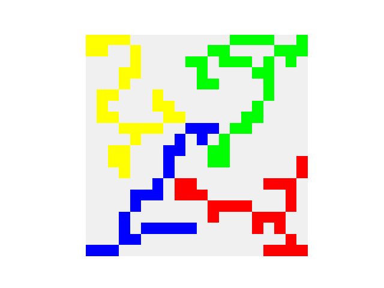

# AI Lab: Blokus


## Tile Detection

- Detection Workflow (src.detection)
  1. Board Segmentation (board_seg)
  2. Normalization (normalization)
  3. Grid Generation (grid)
- For minimum coding, use `detection.detect(...)`


```python
%load_ext autoreload
%autoreload 2

import cv2
import numpy as np
import matplotlib.pyplot as plt

image_path = "readme_files/input.png"

image = cv2.imread(image_path)
plt.imshow(cv2.cvtColor(image, cv2.COLOR_BGR2RGB))
```


    <matplotlib.image.AxesImage at 0x19d9d0d4610>


    

    


### Board Segmentation

- Segmentation Process
  - Get mask from model
  - Crop image using the mask
  - Perspective transformation on the cropped image 


```python
from src.detection import board_seg


img = image.copy()
img = cv2.bilateralFilter(img, 9, 75, 75)
img_segmented = board_seg.board_seg_by_model(img, "models/board_seg.pt")
plt.imshow(cv2.cvtColor(img_segmented, cv2.COLOR_BGR2RGB))
```

    
    0: 640x640 1 board, 370.9ms
    Speed: 8.1ms preprocess, 370.9ms inference, 4.3ms postprocess per image at shape (1, 3, 640, 640)
    


    <matplotlib.image.AxesImage at 0x15092675f10>


    

    


### Image Normalization

- Normalization Process
  - Resize
  - Color Correction
  - Color Mapping


```python
from src.detection import normalization
import src.utils as utils

fig, axes = plt.subplots(1, 3, figsize=(12, 12))

img = cv2.resize(img_segmented, (200, 200))
ax = axes[0]
ax.imshow(cv2.cvtColor(img, cv2.COLOR_BGR2RGB))

img = normalization.__color_correction(img)
ax = axes[1]
ax.imshow(cv2.cvtColor(img, cv2.COLOR_BGR2RGB))

rgyb_thres = (167, 107, 167, 97)
img_normalized = normalization.__color_mapping(img, rgyb_thres)
ax = axes[2]
utils.ax_grid_setting(ax)
ax.imshow(cv2.cvtColor(img_normalized, cv2.COLOR_BGR2RGB))
```


    <matplotlib.image.AxesImage at 0x15093802050>


    

    


### Split Image into Grid

- Grid Generation Steps
  - Split the image into 20x20
  - Get dominant color from each grid


```python
from src.detection import grid
from collections import Counter

color_grid = grid.generate_grid(img_normalized)
print(Counter(color_grid.flatten()))

img_grid = grid.generate_image(color_grid)
plt.imshow(cv2.cvtColor(img_grid, cv2.COLOR_BGR2RGB))
```

    Counter({EMPTY: 284, GREEN: 34, YELLOW: 29, RED: 27, BLUE: 26})
    


    <matplotlib.image.AxesImage at 0x15094064d90>


    

    


## Recommendation

- Recommendation Process
  - Restore game state using detected grid
  - Apply algorithm to get next move


```python
%load_ext autoreload
%autoreload 2
import cv2
import numpy as np
import matplotlib.pyplot as plt
from src import detection
from src.types.tiles import *

image_path = "readme_files/input.png"
image = cv2.imread(image_path)

main_grid = detection.detect(image, rgyb_thres=(165, 107, 160, 97))
main_img = detection.generate_image(main_grid)
plt.imshow(cv2.cvtColor(main_img, cv2.COLOR_BGR2RGB))
```

    
    0: 640x640 1 board, 420.5ms
    Speed: 4.6ms preprocess, 420.5ms inference, 5.9ms postprocess per image at shape (1, 3, 640, 640)
    


    <matplotlib.image.AxesImage at 0x1daded51190>


```python
%matplotlib widget
from src.game.ui import GameContext, render_pyplot, step_random
from src.types.tiles import SquareColor

players = [
    SquareColor.RED,
    SquareColor.GREEN,
    SquareColor.BLUE,
    SquareColor.YELLOW,
]

color_masks = dict((color, 0) for color in players)
for color in players:
    color_mask = np.zeros_like(main_grid, dtype=int)
    color_mask[main_grid == color] = 1
    color_masks[color]= encode_bitboard(color_mask)

key_step_map= {
    " ": step_random,
    "e": lambda ctx: print(
        *("{:<6}\t{}".format(k, v) for k, v in ctx.available_tiles.items()),
        sep="\n",
        end="\n\n",
    ),
    "x": lambda ctx: print(
        *(
            "{:<6}\t{}".format(k, sum(map(lambda p: np.sum(p.decode()), v)))
            for k, v in ctx.available_tiles.items()
        ),
        sep="\n",
        end="\n\n",
    ),
}
render_pyplot(GameContext(players, color_masks), key_step_map)
```





    RED   	57
    GREEN 	50
    BLUE  	58
    YELLOW	54
    
    RED   	{T5, I5, Z5, I3, W5, V3, I1, L4, N5, Z4, I4, T4, O4, X5}
    GREEN 	{T5, I5, I3, I2, V3, U5, L4, Z4, L5, V5, O4, X5}
    BLUE  	{T5, I2, W5, V3, U5, I1, F5, Z4, Y5, I4, L5, V5, O4, X5}
    YELLOW	{T5, I5, Z5, I3, I2, V3, L4, Z4, I4, L5, V5, O4, X5}
    
    No more possible steps for RED
    No more possible steps for RED
    No more possible steps for RED
    No more possible steps for BLUE
    No more possible steps for RED
    No more possible steps for BLUE
    No more possible steps for YELLOW
    No more possible steps for RED
    No more possible steps for GREEN
    RED   	53
    GREEN 	28
    BLUE  	47
    YELLOW	37
    
    RED   	{T5, I5, Z5, W5, V3, L4, N5, Z4, I4, T4, O4, X5}
    GREEN 	{T5, U5, L4, Z4, L5, V5}
    BLUE  	{T5, W5, U5, F5, Z4, I4, L5, V5, O4, X5}
    YELLOW	{I5, Z5, L4, Z4, L5, V5, O4, X5}
    
    


```python
!jupyter nbconvert --to markdown readme.ipynb
```

    [NbConvertApp] Converting notebook readme.ipynb to markdown
    [NbConvertApp] Support files will be in readme_files\
    [NbConvertApp] Writing 8680 bytes to readme.md
    
