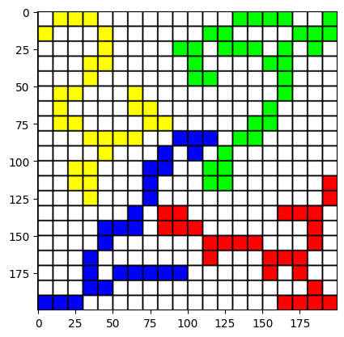
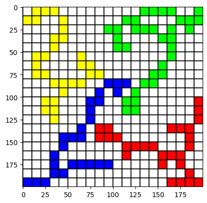

# AI Lab: Blokus


## Tile Detection

- Detection Workflow (src.detection)
  1. Board Segmentation (board_seg)
  2. Normalization (normalization)
  3. Grid Generation (grid)
- For minimum coding, use `detection.detect(...)`


```python
%load_ext autoreload
%autoreload 2

import cv2
import numpy as np
import matplotlib.pyplot as plt

image_path = "readme_files/input.png"

image = cv2.imread(image_path)
plt.imshow(cv2.cvtColor(image, cv2.COLOR_BGR2RGB))
```


    <matplotlib.image.AxesImage at 0x19d9d0d4610>


    

    


### Board Segmentation

- Segmentation Process
  - Get mask from model
  - Crop image using the mask
  - Perspective transformation on the cropped image 


```python
from src.detection import board_seg


img = image.copy()
img = cv2.bilateralFilter(img, 9, 75, 75)
img_segmented = board_seg.board_seg_by_model(img, "models/board_seg.pt")
plt.imshow(cv2.cvtColor(img_segmented, cv2.COLOR_BGR2RGB))
```

    
    0: 640x640 1 board, 370.9ms
    Speed: 8.1ms preprocess, 370.9ms inference, 4.3ms postprocess per image at shape (1, 3, 640, 640)
    


    <matplotlib.image.AxesImage at 0x15092675f10>


    

    


### Image Normalization

- Normalization Process
  - Resize
  - Color Correction
  - Color Mapping


```python
from src.detection import normalization
import src.utils as utils

fig, axes = plt.subplots(1, 3, figsize=(12, 12))

img = cv2.resize(img_segmented, (200, 200))
ax = axes[0]
ax.imshow(cv2.cvtColor(img, cv2.COLOR_BGR2RGB))

img = normalization.__color_correction(img)
ax = axes[1]
ax.imshow(cv2.cvtColor(img, cv2.COLOR_BGR2RGB))

rgyb_thres = (167, 107, 167, 97)
img_normalized = normalization.__color_mapping(img, rgyb_thres)
ax = axes[2]
utils.ax_grid_setting(ax)
ax.imshow(cv2.cvtColor(img_normalized, cv2.COLOR_BGR2RGB))
```


    <matplotlib.image.AxesImage at 0x15093802050>


    

    


### Split Image into Grid

- Grid Generation Steps
  - Split the image into 20x20
  - Get dominant color from each grid


```python
from src.detection import grid
from collections import Counter

color_grid = grid.generate_grid(img_normalized)
print(Counter(color_grid.flatten()))

img_grid = grid.generate_image(color_grid)
plt.imshow(cv2.cvtColor(img_grid, cv2.COLOR_BGR2RGB))
```

    Counter({EMPTY: 284, GREEN: 34, YELLOW: 29, RED: 27, BLUE: 26})
    


    <matplotlib.image.AxesImage at 0x15094064d90>


    

    


## Recommendation

- Recommendation Process
  - Restore game state using detected grid
  - Apply algorithm to get next move


```python
%load_ext autoreload
%autoreload 2
import cv2
import numpy as np
import matplotlib.pyplot as plt
from src import detection
from src.types.tiles import *

image_path = "readme_files/input.png"
image = cv2.imread(image_path)

main_grid = detection.detect(image, rgyb_thres=(165, 107, 160, 97))
main_img = detection.generate_image(main_grid)
plt.imshow(cv2.cvtColor(main_img, cv2.COLOR_BGR2RGB))
```

    
    0: 640x640 1 board, 565.8ms
    Speed: 6.5ms preprocess, 565.8ms inference, 0.0ms postprocess per image at shape (1, 3, 640, 640)
    


    <matplotlib.image.AxesImage at 0x2a892b066d0>


    

    


### Interactive Gamer Runner


```python
%matplotlib widget
from src.game.ui import render_pyplot
from src.game.logic import *
from src.types.tiles import SquareColor

players = [
    SquareColor.RED,
    SquareColor.GREEN,
    SquareColor.BLUE,
    SquareColor.YELLOW,
]

color_masks = dict((color, 0) for color in players)
for color in players:
    color_mask = np.zeros_like(main_grid, dtype=int)
    color_mask[main_grid == color] = 1
    color_masks[color]= encode_bitboard(color_mask)

key_step_map= {
    "1": step_random,
    "2": step_greedy,
    "3": step_maxn,
    "z": log_available_tiles,
    "x": log_player_score,
}
render_pyplot(GameContext(players, color_masks), key_step_map)
```

    Warning: Invalid tiles detected
    


<div style="display: inline-block;">
    <div class="jupyter-widgets widget-label" style="text-align: center;">
        Figure
    </div>
    
</div>


    RED   	28
    GREEN 	39
    BLUE  	30
    YELLOW	35
    
    RED   	42
    GREEN 	48
    BLUE  	41
    YELLOW	43
    
    No more possible steps for GREEN
    No more possible steps for BLUE
    No more possible steps for YELLOW
    No more possible steps for RED
    No more possible steps for GREEN
    No more possible steps for BLUE
    RED   	42
    GREEN 	48
    BLUE  	41
    YELLOW	43
    
    No more possible steps for YELLOW
    No more possible steps for RED
    No more possible steps for GREEN
    No more possible steps for BLUE
    No more possible steps for YELLOW
    No more possible steps for RED
    RED   	42
    GREEN 	48
    BLUE  	41
    YELLOW	43
    
    No more possible steps for GREEN
    No more possible steps for BLUE
    No more possible steps for YELLOW
    No more possible steps for RED
    No more possible steps for GREEN
    RED   	42
    GREEN 	48
    BLUE  	41
    YELLOW	43
    
    RED   	42
    GREEN 	48
    BLUE  	41
    YELLOW	43
    
    


```python
!jupyter nbconvert --to markdown readme.ipynb
```

    [NbConvertApp] Converting notebook readme.ipynb to markdown
    [NbConvertApp] Support files will be in readme_files\
    [NbConvertApp] Writing 8817 bytes to readme.md
    
