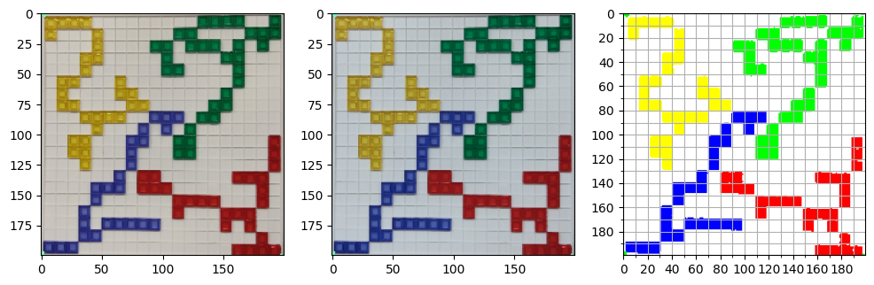

# AI Lab: Blokus


## Tile Detection


```python
import cv2
import numpy as np
import matplotlib.pyplot as plt


image_path = "readme_files/input.png"

image = cv2.imread(image_path)
plt.imshow(cv2.cvtColor(image, cv2.COLOR_BGR2RGB))
```


    <matplotlib.image.AxesImage at 0x23f11e3fd90>


    

    


### Board Segmentation


```python
from src.detection import board_seg


img = image.copy()
img = cv2.bilateralFilter(img, 9, 75, 75)
img_segmented = board_seg.board_seg_by_model(img)
plt.imshow(cv2.cvtColor(img_segmented, cv2.COLOR_BGR2RGB))
```

    
    0: 640x640 1 board, 648.0ms
    Speed: 9.3ms preprocess, 648.0ms inference, 15.6ms postprocess per image at shape (1, 3, 640, 640)
    


    <matplotlib.image.AxesImage at 0x23f3dd245d0>


    

    


### Image Normalization


```python
from src.detection import normalization


fig, axes = plt.subplots(1, 3, figsize=(12, 12))

img = cv2.resize(img_segmented, (200, 200))
ax = axes[0]
ax.imshow(cv2.cvtColor(img, cv2.COLOR_BGR2RGB))

img = normalization.__color_correction(img)
ax = axes[1]
ax.imshow(cv2.cvtColor(img, cv2.COLOR_BGR2RGB))

rgyb_thres = (167, 107, 167, 97)
img_normalized = normalization.__color_mapping(img, rgyb_thres)
ax = axes[2]
major_ticks = np.arange(0, 201, 20)
minor_ticks = np.arange(0, 201, 10)
ax.set_xticks(major_ticks)
ax.set_xticks(minor_ticks, minor=True)
ax.set_yticks(major_ticks)
ax.set_yticks(minor_ticks, minor=True)
ax.grid(which="both")
ax.imshow(cv2.cvtColor(img_normalized, cv2.COLOR_BGR2RGB))
```


    <matplotlib.image.AxesImage at 0x23f2710d450>


    

    


### Split Image into Grid


```python
from src.detection import grid


img_mini, img_full = grid.generate_grid(img_normalized)
plt.imshow(cv2.cvtColor(img_full, cv2.COLOR_BGR2RGB))
```


    <matplotlib.image.AxesImage at 0x23f2714d290>


    

    


```python
from collections import Counter
from src.types.tiles import SquareColor


result = grid.detect_colors(img_mini)
print(Counter(result.flatten()))

pos_dict = dict((color, np.argwhere(result == color)) for color in SquareColor)
for key in pos_dict:
    print(f"{key:<6}", *pos_dict[key][:10], sep="\t")
```

    Counter({EMPTY: 286, GREEN: 32, YELLOW: 30, RED: 27, BLUE: 25})
    EMPTY 	[0 0]	[0 1]	[0 2]	[0 3]	[0 4]	[0 5]	[0 6]	[0 7]	[0 8]	[0 9]
    RED   	[8 5]	[8 6]	[9 5]	[9 6]	[10  5]	[11  3]	[11  4]	[12  4]	[13  4]	[14  4]
    GREEN 	[ 9 17]	[10 15]	[10 16]	[10 17]	[11  8]	[11  9]	[11 15]	[11 18]	[12  8]	[12  9]
    BLUE  	[1 0]	[2 0]	[3 1]	[3 2]	[3 3]	[4 1]	[4 4]	[4 5]	[5 2]	[5 5]
    YELLOW	[ 0 18]	[ 0 19]	[ 1 12]	[ 1 13]	[ 1 14]	[ 1 19]	[2 8]	[2 9]	[ 2 12]	[ 2 14]
    


```python
!jupyter nbconvert --to markdown readme.ipynb
```

    [NbConvertApp] Converting notebook readme.ipynb to markdown
    [NbConvertApp] Support files will be in readme_files\
    [NbConvertApp] Writing 3028 bytes to readme.md
    
